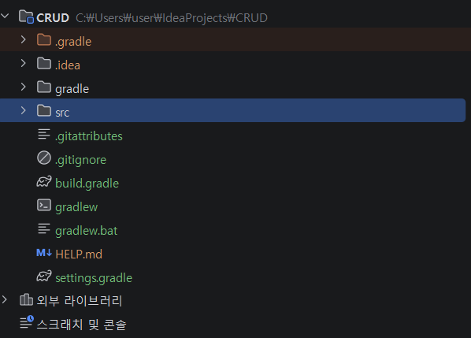

# Spring Boot 기반 REST API 개발 및 PostMan을 활용한 테스트

## 1. Spring boot 사용법 (프로그래밍 언어 Java) 공부

### Spring boot?
업계 표준 jetbrain이라는 회사에서 만든 intellj라는 IDE(개발 도구)를 활용하여 spring boot로 빌드 관리 도구 gradle(설정 + 컴파일 역할 수행) - 그안에 쓰인 java 간소화된 문법인 groovy 문법으로 설정하여 진행하겠음.

웹을 잘 만들기 위해 만든 라이브러리 모음인 spring(java로 구현됨)을 활용해 최소한의 웹 동작이 가능하도록 설계된 기초 틀인 spring boot로 웹 개발을 빠르게 하기 위해 만들어진 기본 웹임

### 그럼 무엇을 공부해야하나?

프로젝트 폴더는 크게 4부분 + 참조로 구성된다.
.gradle 폴더 / .idea 폴더 / gradle 폴더 / src 폴더 + 외부라이브러리

### 신경쓰지말자! (자동 관리 폴더)
* **`.gradle` 폴더:** .gradle 폴더는 gradle이 빌드를 실행하면서 만든 임시파일 + Cache data가 들어 있어서 이는 gradle이 관리하는 파일이라 직접 건드릴 필요가 없고 , build.gradle파일을 활용해 필요한 설정을 주어 파일으로 조정하면 된다.
* **`.idea` 폴더:** intellj IDEA가 만들어둔 해당 프로젝트의 설정 파일, 즉, intellj 실행에 필요한 파일이라 직접 건드릴 필요가 없다.
* **`gradle` 폴더:** 하위 폴더에 wrapper라는 폴더가 존재할 것이다. 이는 Gradle이 설치되어있지 않더라도 실행될수 있도록 한다. 즉, 어느 컴퓨터에서 gradle파일을 실행하더라도 프로젝트 폴더만 있다면 실행 가능하다! Gradle 실행에 필요한 파일이라 직접 건드릴 필요가 없다.

### 공부하자! (`src` 폴더)

* 하위 **`main` 폴더 하위 `java` 폴더**에 프로젝트 생성시 java 패키지가 들어감, main(시작점) 역할 함수인 Application존재 → 해당 함수로 실행 가능
* 하위 **`main` 폴더 하위 `resource`폴더에 `static`폴더**에 웹 브라우저(chrome)이 파싱해서 → 웹 페이지를 화면에 띄울 수있도록 CSS, JavaScript, 이미지파일이 들어감
* 하위 **`main` 폴더 하위 `resource`폴더에 `templates`폴더** HTML파일을 넣음, 상황에 따라 유연한 대처를 위해 직접 HTML하나하나를 바꾸는것이 아니라 java에 저장된 변수값으로 HTML을 쉽게 바꾸기 위해 Thymleaf(업계 사용량 높은 도구, React, Vue, JSP 등 다양한 도구 존재)라는 도구 활용
* 하위 **`main` 폴더 하위 `resource`폴더에 `application.properties`** (설정의 계층 구조를 한눈에 보기 편한 application.yml(.yaml)을 사용하기도 함)파일에 해당 프로그램의 설정값, 즉, 우리는 서버 역할을 할 프로그램을 만드는 것, 서버의 설정값(서버가 사용할 Port Number, DB IP 주소, 비밀번호)을 넣음

---

## 2. 시작하자! (프로젝트 생성 및 설정)

### 새 프로젝트 생성법
intelllj를 실행 > 새 프로젝트 생성 > spring boot로 만들기 설정 > 세부 설정 {프로젝트 이름, 사용 언어, 빌드 관리 도구 설정 - gradle(groovy), group(java 패키지 이름 설정, 실제 도메인 google.com이라면 com.goole을 이름으로 하는 관행이 존재함)

### 의존성 옵션 선택
* **Spring Web:** 내장 Tomcat(간이) 서버로 개발단계에서 빠른 테스트 가능
* **Spring Data JPA:** Java로 SQL쿼리문 생성해줘서 DB접근 가능함
* **H2 Database:** 개발 단계에서 사용되는 간이 DB
* **Lombok:** Java 캡슐화 필수 메서드 구현인 get, set method를 해당 어노테이션으로 @Getter, @Setter로 구현 생략(내부적으로 구현 자동화) 가능하게 해줌
* **Developer Tools:** 코드가 저장될 때마다 해당 코드로 서버를 재시작 시켜주어 바로 적용된 서버를 확인가능

---

## 3. 웹 개발 구조 (계층화 아키텍처)

실제 웹 개발을 위해 작성해야 하는 것. 해당 구조는 계층적(상호 분리적) 구조를 가지고 있음. 자신의 역할을 충실히 이행함으로써 다른 부분은 고려하지 않아도 되서 협업과 개발이 간단화 될 수 있어짐. 부분 테스트 가능.

* **화면구성:** Thymleaf(템플릿 엔진) + HTML(View, 화면)
* **DB접근:** Repository에서 JPA를 통해 DB 접근 Entity 생성
* **Service:** 프로그램 로직, Entity에서 DTO(필요 정보만 Thymleaf에 반환, 보안 달성), 트랜젝션 관리

**User(Web Browser) ↔ Controller ↔ Service ↔ Repository ↔ Database**

* **Controller (입구)**
  1. 유저가 클릭하여 매핑된 URL 주소로 요청이 온다면 Service에게 요청 보냄
  7. DTO를 Thymeleaf에 넣어서 HTML로 보냄 → HTML이 전송됨
  > `@RestController`(JSON(데이터)만 반환할때/ 사용, `@Controller`(템플릿 엔진을 사용해 HTML(화면)을 반환할때 사용), `@GetMapping` 활용
* **Service (실제 서버에서 반응할 웹의 핵심 로직)**
  1. 해당 요청이 DB내용이 필요하다면 Repository에게 요청을 보냄
  6. Repository에게 받은 Entity 객체(Table)를 → DTO에 요청에 필요한 정보만 추출하여 담아서 Controller에게 보냄
  > `@Service` 활용, `@Transactional`
* **Thymeleaf (화면 연결)**
* **Repository (DB 관리자)**
  1. `repository.save(Entity 객체)`를 실행 →JPA가 java Entity 객체를 활용해서 SQL문 쿼리 작성 → 실제로 연결된 DB에 요청을 보냄
  5. DB에게 받은 데이터 Table을 Entity 객체로 만듬
  > JAVA의 `interface` 문법으로 `JpaRepository`를 상속받아 만듬
* **Entity(DB내부를 Java내부에서 만든 데이터 원본)**
  > `@Entity`, `@Id` 활용
* **DTO (DB조회 결과를 화면에 보여주기 위해 만듬)**
  > `@Data` 활용(Lombok - Getter, Setter(프로그래밍 언어 Java에서 캡슐화 원칙을 위해 get method와 set method를 필수적으로 구현이 필요함)을 자동화시킴)
* **DB 연결 (JPA)**
  1. DB가 데이터 Table을 반환함

심화 구현 - 예외처리, 데이터 유효성 검사, 보안, 페이징 및 정렬

---

## 4. 만들어보자! (Bottom-Up 방식 설계)

초보자 추천 루트 - DB와 가까운 곳부터 설계방식 - Bottom-Up 방식 설계

1. **Entity 설계 - DB Table 형식 → java로 만들기**
   저장할 데이터를 클래스로 만들자 (데이터이름.java) - @Entity, @Id, `@GeneratedValue`, `@Column` 활용
2. **Repository 생성 - DB 접근**
   `Interface`를 만들자 - `JpaRepository<Entity 클래스, ID 타입>`을 상속 받음(데이터이름Repository.java)
3. **DTO 생성 - 화면에서 입력 받을 데이터, 화면에 보여줄 데이터**
   입력 받을 데이터, 보여줄 데이터의 클래스 만들기(데이터이름CreateRequestDto, 데이터이름ResponseDto)
4. **Service 구현 - DTO(화면 입력 데이터) → Entity, Entity → DTO(화면 출력 데이터)**
   `@Service` 클래스 만들기(데이터이름Service.java)
   Repository를 호출하여 데이터 저장, 가공
5. **Controller 구현 - 웹 진입점(사용자와 소통)**
   `@Controller` 클래스 만들기(데이터이름Controller.java)
   `@GetMapping(”/example/example”)` 에 실제로 쓰일 URL 넣기, 매핑
   User의 요청에 따른 Service 호출 리턴값을 → Model(HTML파일은 JAVA코드 내부 데이터를 직접 가져갈수 없어서 이 방법을 사용, Key Value형식)에 담아 Thymeleaf HTML 파일을 사용자에게 리턴함
6. **Thymeleaf와 HTML 작성**
   src/main/templates폴더에 HTML파일 작성하고, Controller가 리턴한 data를 HTML 내부에 직접 넣어 이것을 사용자에게 리턴

**!! 웹 개발 필수 상식**
* **Spring에서는 new로 객체를 생성하지 않음:** Spring Container가 알아서 객체를 만듬 → 권장 방법 - 생성자 주입 Lombok의 `@RequireArgsConstructor`를 클래스 위에 쓰고, 해당 클래스 내부에 `private final` 키워드로 객체를 선언(C의 `int a;`와 같이 실제 객체가 담겨있음 선언만 적어도)
* **웹의 기본 상식: PRG(Post-Redirect-Get) 패턴 - redirect:** 언제 : Create(생성), Update(수정), Delete(삭제) 직후. 만약 글 작성을 완료하고 나서 일반적인 HTML 화면을 반환하면, 사용자가 새로고침 시 같은 내용이 DB에 계속 저장 요청되는 현상이 발생. POST 요청(데이터 변경) 처리가 끝나면, 반드시 다른 URL로 Redirect(강제이동) 시켜야 함.
* **웹의 기본 상식: GET/ POST - 클라이언트의 요청:** 클라이언트가 서버로부터 data 달라고 요청하는 것 GET. 클라이언트가 보내는 data 넣어달라고 요청하는 것 POST.
* **작성 패키지 위치:** 작성한 java 파일은 프로젝트 생성시 만들어진 패키지 하위에 넣어야함. 그 하위 패키지들만 자동으로 탐색(Component Scan) 하여 우리가 작성한 `@Controller`, `@Service`, `@Entity` 등의 설정을 읽어옵니다. 만약 저 폴더 밖(예: java 폴더 바로 아래)에 만들면 스프링이 파일들을 찾지 못해 에러가 발생.

---

## 5. 협업 및 실제 서비스 배포 아키텍처

**혼자하는 것이 아닌 협업에서는 어떻게 만들어야할까?**
Backend-Frontend 완전 분리 구조

### 개발 단계
* **Backend 역할 - Spring boot 이용:** 따로 서버 실행. Frontend에게 받은 요청을 DB에서 data를 받아서 서버에서 Java로 구현한 프로그램으로 조작하고 (Controller가 `@RestController`)Json을 반환함
* **Frontend 역할 - React, Vue 이용:** 따로 서버 실행. 사용자가 조작할 화면 구현. 사용자의 조작에 맞는 응답이 data를 필요로 할시, Backend에게 요청

### 실제 서비스 단계
* **Frontend:** 개발이 끝난 React(Vue) 소스 코드 → Build 명령어 실행 → HTML, CSS, JavaScript 파일로 압축 세트. 웹 호스팅(CDN(Content Delivery Network, 웹 캐시(원본 서버에서 데이터 미리 Load), 정적 호스팅(기본 결과물) - 서버의 계산량 0, 요청 파일만 반환) 서비스(AWS S3, Vercel, Cloudflare) 이용해서 Build된 압축 세트를 올려둠
* **Backend:** 개발이 끝난 프로그램 → 서버(AWS EC2, 동적 호스팅(매번 결과물이 다른걸 줌)(웹 캐시(Redis))- 서버가 실시간 계산, 해당 응답에 맞는 데이터 조작 처리 실행)에서 24시간 실행
* **사용 시나리오:** 사용자 사이트 접속 → 웹 호스팅 서비스에 있는 압축 세트 다운 받음 → 화면이 Backend서버(AWS EC2)에게 요청 보냄

---

## 6. 실제 서비스되는 형식으로 만들어보자!

**1. 프로젝트 생성하기**
IntelliJ를 실행하고 [New Project (새 프로젝트)]를 클릭 > [Spring Boot] 선택
* 세부 설정
  * Name: 프로젝트 이름
  * Location: 프로젝트를 저장할 폴더
  * Language: Java
  * Type: Gradle - Groovy
  * Group: com.unknown
  * Artifact: 프로젝트 이름(Name으로 자동 설정됨)
  * Package name: com.unknown.crud (Group.Name으로 자동설정됨)
  * JDK / Java: 17(표준 버전)
  * Packaging: Jar(자바 압축 파일임)

**2. 의존성(Dependencies) 설정 - build.gradle 설정 파일 내용 결정**
* Spring Web - 개발용 임시 서버 (Web 카테고리) 내장 톰캣 서버와 API 통신을 위한 필수 부품
* Spring Data JPA - Java 코드로 DB접근 자동화SQL 카테고리) DB와 소통할 수 있게 해주는 마법의 번역기
* H2 Database - 개발용 임시 DB(SQL 카테고리) 개발 단계에서 아주 가볍게 쓸 임시 DB 창고
* Lombok - Java get set 메서드 자동화 생성(코드 구현 자동화 개발자는 @Getter @Setter 어노테이션만 작성)
* Spring Boot DevTools - 코드 저장시 서버 자동 재시작(서버에 코드 내용 바로 적용)

!! JSON으로 받은 데이터 → Jackson(객체로 매핑해줌)이 date를 Java 객체로 변환 → 이를 위해 RequestDto는 `@Setter` (data → Java 객체화를 위해), `@Getter` (저장된 객체 → data 읽기 위함)

**3. DB와 가까운 곳부터 설계방식 - Bottom-Up 방식 설계**
1. **entity 폴더 생성, Class - Entity 만들기 (실제 DB와 연동, CRUD가 같이 일어남)**

**어노테이션(Anotation) 설명:**
* `@Entity`: JPA가 DB record 1개 -> Entity 객체로 만듬, Java의 Entity 객체와 실제 DB와 연동
* `@Getter`: Java getmethod 자동 생성
* `@NoArgsConstructor(access = AccessLevel.PROTECTED)`: 생성자 자동 호출, 개발자가 new 키워드로 객체 생성 못하게 막음(Entity 객체를 JPA만 관리 가능)
* `@Id`: DB PK 역할
* `@GeneratedValue(strategy = GenerationType.IDENTITY)`: DB data 삽입, Id 값 1씩 자동 증가
* `@Column(nullable =false)`: DB NOT NULL - 필수 입력
* `@Builder`: JPA가 Entity 객체를 생성시 사용할 생성자

2. **dto 폴더 생성, Class - Dto 만들기** (JSON data → 받을 객체 만들기, Entity 객체(DB data) → 보낼 객체 만들기)

---

## 7. API 구조 및 POSTMAN으로 API 테스트하기

### API 구현
Bottom-up 방식 설계(DB와 가까운 곳부터 설계)
구현 순서 `entity` → `repository` → `dto` → `service` → `controller` 구현
entity - DB

### API 구조 (구현 코드 폴더 구조)

### 실제 통신로
**Client(POSTMAN) ↔ Controller(WorkoutApiController.java)**
JSON으로 data를 보냄 → 어떤 요청(POST, GET, PATCH, PUT, DELETE)에 대응되는지 확인후 Service호출 → 요청에 맞는 JSON(ResponseEntity에 담아서)으로 요청 data 응답(return 반환)

### 내부 계층화
* **Controller(WorkoutApiController.java) ↔ Service**
  역할 : Client의 요청을 구분하여 적절한 Service 호출, Http에 맞는 상태코드 + body(선택)하여 반환
* **Service(WorkoutService) ↔ Repository**
  인터페이스로 구현한 Repository(실제 클래스화되어 객체화됨)에게 Service가 호출하여 Controller에게 Dto로 받은 data를 Repository에게 넘겨줌
  역할 : DB제어를 담당하는 Repository에게 요청을 보냄 → API가 제공하는 기능 제공(DB에 생성, 조회, 수정, 삭제)
* **Repository(WorkoutRecordRepository) ↔ 실제 DB**
  Service에게 Dto를 통해 받은 데이터를 실제 구현된 Entity Class를 통해 객체를 만들어서 관리 → 실제 DB와 연동(Entity 내용이 바뀌면 DB 내용도 변화, 실제 쿼리문을 보냄)
  역할 : DB 제어
  DB(H2base - 간이 DB, 메모리에서 동작(Spring boot 내장 Tomcat 서버 재시작시 마다 초기화됨)) ↔ Repository
  Repository로 부터 쿼리문을 받은 DB가 실제 결과 저장 후 → ID값 반환
  역할 : DB - table 실제 저장 공간

### POSTMAN 실행결과

CREATE - POST

READ - GET(단일 조회)

READ - GET(전체 조회 - 리스트)

UPDATE - PATCH

DELETE - DELETE(전체 테이블 삭제)

DELETE - DELETE(단일 데이터 삭제)

### 결론
PostMan으로 REST API CRUD 테스트 완료
HTTP POST, GET, PATCH, DELETE → PUT은 사용안함(운동 기록에 적합하지 않음)