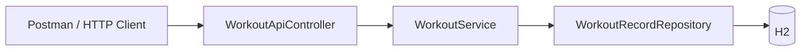

# Workout REST API

**운동 기록의 생성·조회·수정·삭제를 구현한 Spring Boot 개인 학습 프로젝트입니다.**

Controller → Service → Repository로 역할을 나누고, JPA와 H2를 사용해 데이터를 저장합니다. 요청·응답 DTO와 HTTP 상태 코드를 Postman으로 확인한 과정을 기록했습니다.

`Java 17` · `Spring Boot 4.0.5` · `Spring Data JPA` · `H2` · `Gradle` · `Lombok`

[전체 학습 기록과 Postman 화면](docs/learning-notes.md) · [API Controller](src/main/java/com/unknown/crud/controller/WorkoutApiController.java)

## 요청·응답 미리보기


> 기존 Postman 실행 기록입니다. 여러 메서드의 요청·응답 화면은 학습 기록에서 확인할 수 있습니다.

## API 구성

기본 URL: `http://localhost:8080/api/workouts`

| 메서드 | 경로 | 동작 | 성공 코드 |
| --- | --- | --- | --- |
| POST | `/api/workouts` | 운동 기록 생성 | 201 |
| GET | `/api/workouts` | 전체 기록 조회 | 200 |
| GET | `/api/workouts/{id}` | 단일 기록 조회 | 200 |
| PATCH | `/api/workouts/{id}` | 기록 수정 | 200 |
| DELETE | `/api/workouts/{id}` | 단일 기록 삭제 | 204 |
| DELETE | `/api/workouts` | 전체 기록 삭제 | 204 |

## 로컬 실행

`build.gradle`에서 Java 17 toolchain을 지정합니다. JDK 17을 준비하고 저장소에 포함된 Gradle Wrapper로 실행합니다.

```bash
git clone https://github.com/unknownamed/Implementing-a-simple-REST-API-with-Spring-Boot.git
cd Implementing-a-simple-REST-API-with-Spring-Boot
```

```powershell
# Windows
.\gradlew.bat bootRun
```

```bash
# macOS / Linux
sh ./gradlew bootRun
```

별도 DB 서버 없이 H2를 사용하는 구성입니다. 현재 설정에 파일 기반 영속 저장은 지정되어 있지 않습니다.

## 생성 요청 예시

`POST http://localhost:8080/api/workouts`에 `Content-Type: application/json`과 아래 본문을 보냅니다.

```json
{
  "workoutDate": "2026-10-01",
  "workoutType": "헬스",
  "weight": 40.0,
  "sets": 3,
  "reps": 12
}
```

`workoutDate`, `workoutType`은 엔티티의 필수 필드입니다. 달리기 기록에는 `distanceKm`, `durationMinutes`를 사용할 수 있습니다.

### 현재 구현 범위

PATCH도 DTO의 모든 필드를 엔티티에 대입하므로 **생략한 필드가 null로 바뀔 수 있습니다**. 기존 값을 유지하려면 필요한 값을 함께 보내야 합니다. 요청 검증과 없는 ID의 예외를 4xx 응답으로 변환하는 처리는 추가 보완이 필요합니다.

## 구조


```mermaid
flowchart LR
    Client[Postman / HTTP Client] --> Controller[WorkoutApiController]
    Controller --> Service[WorkoutService]
    Service --> Repository[WorkoutRecordRepository]
    Repository --> H2[(H2)]
```

- [DTO](src/main/java/com/unknown/crud/dto/WorkoutDto.java): 생성·수정 요청 및 응답
- [Service](src/main/java/com/unknown/crud/service/WorkoutService.java): 트랜잭션과 CRUD 처리
- [Entity](src/main/java/com/unknown/crud/entity/WorkoutRecord.java): 운동 기록 필드
- [학습 기록](docs/learning-notes.md): 개발 과정, 구조 설명, 실행 결과
